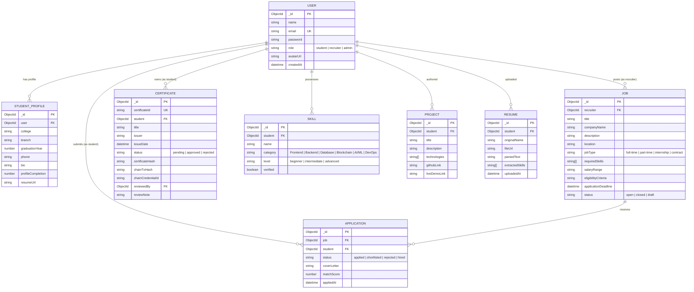

# SkillChain Entity-Relationship (ER) Architecture

```mermaid
erDiagram
    USER ||--o{ STUDENT_PROFILE : "has profile"
    USER ||--o{ JOB : "posts (as recruiter)"
    USER ||--o{ APPLICATION : "submits (as student)"
    USER ||--o{ CERTIFICATE : "owns (as student)"
    USER ||--o{ SKILL : "possesses"
    USER ||--o{ PROJECT : "authored"
    USER ||--o{ RESUME : "uploaded"
    
    JOB ||--o{ APPLICATION : "receives"
    
    USER {
        ObjectId _id PK
        string name
        string email UK
        string password
        string role "student | recruiter | admin"
        string avatarUrl
        datetime createdAt
    }

    STUDENT_PROFILE {
        ObjectId _id PK
        ObjectId user FK
        string college
        string branch
        number graduationYear
        string phone
        string bio
        number profileCompletion
        string resumeUrl
    }

    SKILL {
        ObjectId _id PK
        ObjectId student FK
        string name
        string category "Frontend | Backend | Database | Blockchain | AI/ML | DevOps"
        string level "beginner | intermediate | advanced"
        boolean verified
    }

    PROJECT {
        ObjectId _id PK
        ObjectId student FK
        string title
        string description
        string[] technologies
        string githubLink
        string liveDemoLink
    }

    CERTIFICATE {
        ObjectId _id PK
        string certificateId UK
        ObjectId student FK
        string title
        string issuer
        datetime issueDate
        string status "pending | approved | rejected"
        string certificateHash
        string chainTxHash
        string chainCredentialId
        ObjectId reviewedBy FK
        string reviewNote
    }

    JOB {
        ObjectId _id PK
        ObjectId recruiter FK
        string title
        string companyName
        string description
        string location
        string jobType "full-time | part-time | internship | contract"
        string[] requiredSkills
        string salaryRange
        string eligibilityCriteria
        datetime applicationDeadline
        string status "open | closed | draft"
    }

    APPLICATION {
        ObjectId _id PK
        ObjectId job FK
        ObjectId student FK
        string status "applied | shortlisted | rejected | hired"
        string coverLetter
        number matchScore
        datetime appliedAt
    }

    RESUME {
        ObjectId _id PK
        ObjectId student FK
        string originalName
        string fileUrl
        string parsedText
        string[] extractedSkills
        datetime uploadedAt
    }
```

